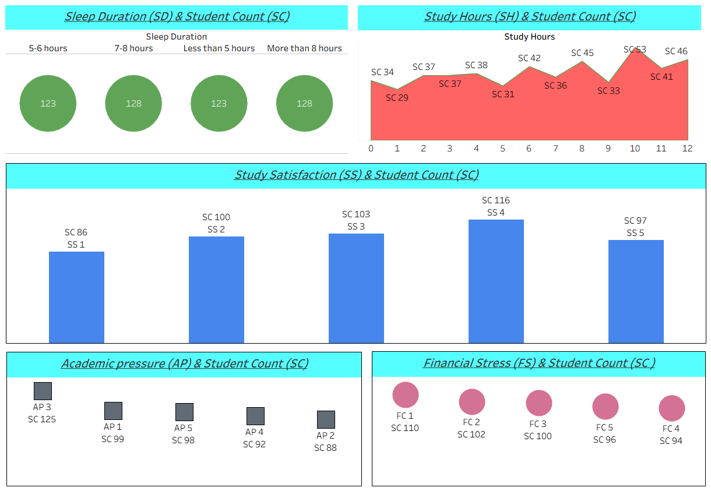

# Student Depression Analysis using SQL and Tableau

This project analyzes factors contributing to **student depression** using SQL for data cleaning & transformation, and Tableau for interactive visualization.  

👉 **Interactive Dashboard Link:** [Click Here](https://public.tableau.com/views/Student_Depression_Analysis/StudentCountAnalysis?:language=en-US&publish=yes&:sid=&:redirect=auth&:display_count=n&:origin=viz_share_link)

---

## 🔹 Data Preparation (SQL)

- ✅ Handled **NULL and empty values**.  
- ✅ Converted binary columns (`0/1`) into categorical values (`Yes/No`).  
- ✅ Added an **Index column** for better referencing.  
- ✅ All SQL queries used for cleaning and transformation are available in the repository.  

---

## 📊 Dashboard (Tableau)

The Tableau dashboard contains **five visualizations** highlighting key factors:  

1. **Sleep Duration** – Relationship between sleep patterns and mental health.  
2. **Study Hours** – Impact of study load on stress levels.  
3. **Study Satisfaction** – Correlation between satisfaction with study habits and depression indicators on scale of 1 to 5.  
4. **Financial Stress** – Financial constraints as a contributing factor, show with level of 1 to 5.  
5. **Academic Pressure** – Effect of academic expectations on mental well-being, show with level of 1 to 5.  

---

## 🖼️ Dashboard Preview

  

---

## 🚀 How to Use

1. Explore the **SQL queries** in the `/sql` folder to understand data cleaning steps.  
2. Open the **Tableau dashboard link** for interactive analysis.  
3. Check the attached **screenshots** for quick insights.  

## 🛠️ Tech Stack

- **SQL** – Data cleaning & preprocessing  
- **Tableau** – Interactive dashboard & visualization  

